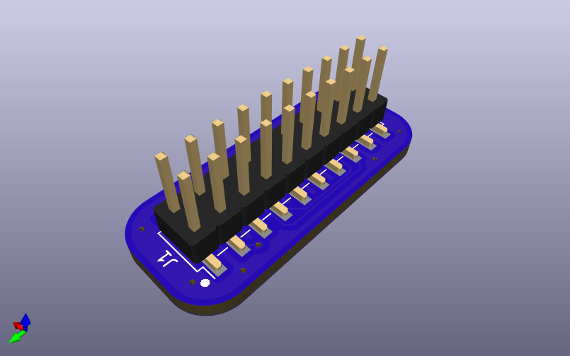
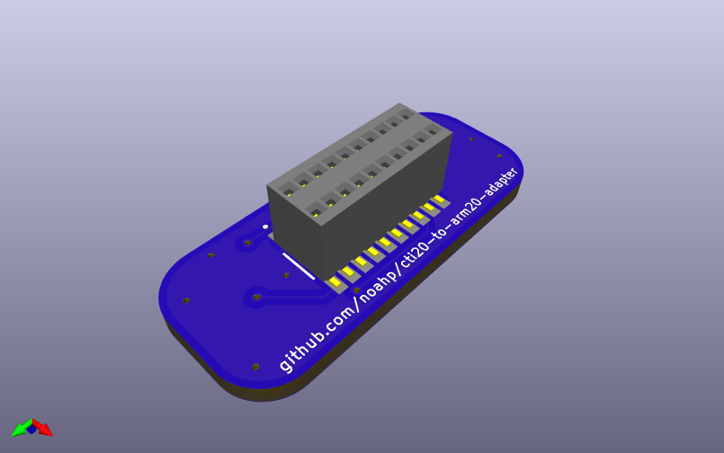

# ARM 20-pin to TI "CTI20-pin" adapter

Connectors:

- CTI20-pin receptacle: [Amphenol
  20021321-00020C4LF](https://www.digikey.com/en/products/detail/amphenol-cs-fci/20021321-00020C4LF/2209069)
- ARM 20-pin header:
  - shrouded: [CNC Tech
    3020-20-0300-00](https://www.digikey.com/en/products/detail/cnc-tech/3020-20-0300-00/3441742)
  - unshrouded: [Amphenol
    54202-G0810LF](https://www.digikey.com/en/products/detail/amphenol-cs-fci/54202-G0810LF/1490928)

